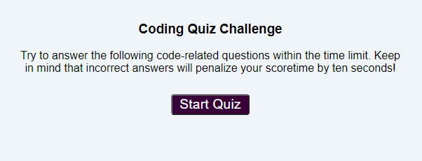
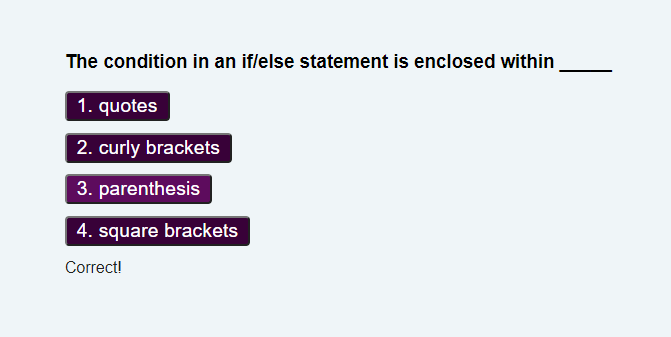
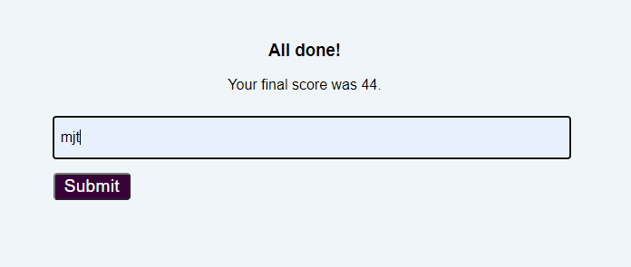
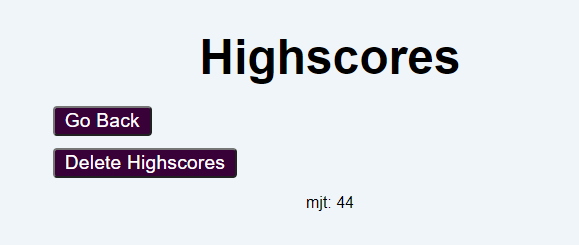

# Homework-4-Tanner
## Synopsis 
#### We were to practice our HTML, CSS and Java by implementing a web resident quiz game that tests the users knowledge about rudimentary computer science and programming.
## What's in the box?
##### 1. README.md: This file.
##### 2. index.html: Default start page, welcoms the user and presents a 'Start' button.
##### 3. quiz.html: Governs the layout of the quiz game. 
##### 4. scriptquiz.js: Governs the content and operation of the quiz game.                  |
##### 5. highscoreset.html: Layout for ths user to perform score related functions 
##### 6. scripthighscoreset.js: Governs the operation of score related functions.
##### 7. highscores.html: Layout for "Go Back" and "Delete High Scores" selection.
##### 8. scripthighscores.js: Layout for "Go Back" and "Delete High Scores" selection.
##### 9. style.css: Controls as aspects of look and feel. 
## Top Down Design
### Program Implementation According to Specifications
#### A. Landing, explanatory verbage and start button

#### B. Game Operation
##### 1. Implement Clock
##### 2. Cycle through all quiz questions.
###### a. Implement individual question.
###### (1) Feed the text to the appropriate html containers.
###### (2) Get the user's response.
###### (3) Determine if the response it the correct on.
###### (4) If the response is wrong, decrement the clock and repeat. 

#### C. Post-Game Implementation
##### 1. Remaining time on the clock saved to user's score in all cases:
###### a. The user completes all questions.
###### b. The clock expires as a function of real time.
###### c. The clock expires on penalties.
##### 2. If the user's final score is greater than any previously records, make a new record.
###### a. Prompt the user for initials.

###### b. Query localStorage for an existing with fewer points.
###### c. Record the user-highscore pair in localStorage. 
##### 3. Present highscore data with "delete highscore" and "go back" options.

## What else needs to be done?
##### 1. Fully develope the Highscore database.
##### 2. Make the style look and feel consistent thoughout.
##### 3. Fully resolve the "document.location=" of "document.location.apply()" vs. "window.open()" and "window.close()" conundrum.
##### 4. Implement methods for importing series of questions and correct responses. 
